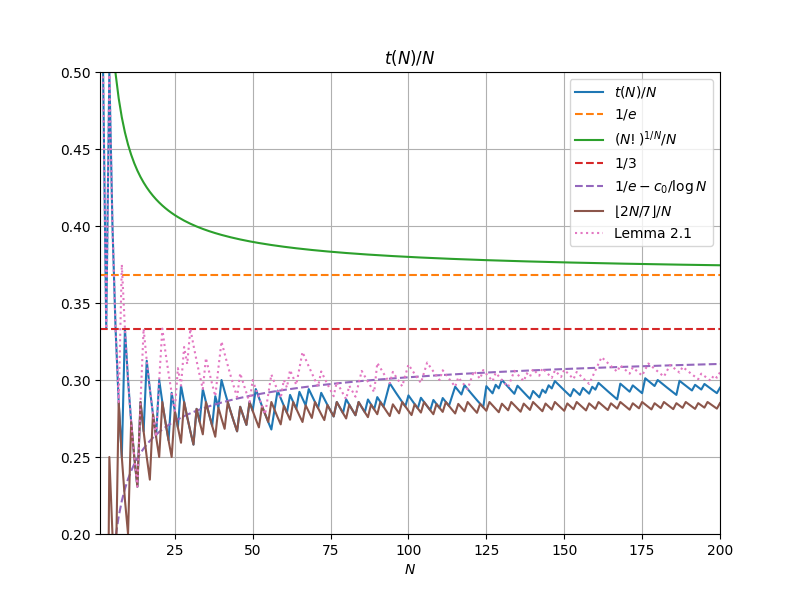
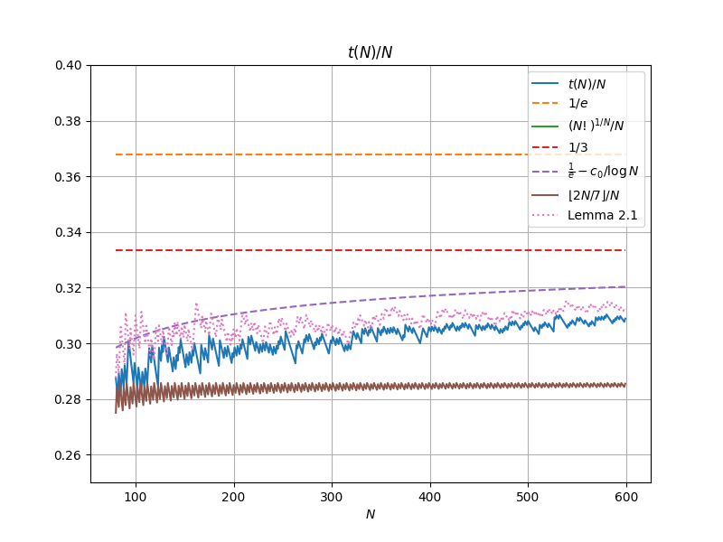
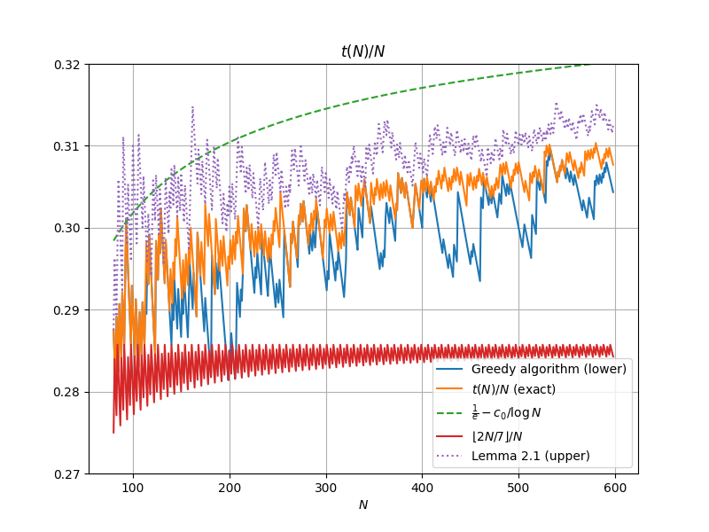

# Verifying the Guy-Selfridge conjecture

For a natural number $N$, let $t(N)$ be the largest number such that $N!$ can be factored into $N$ integer factors, each of which is at least $t(N)$.  [It is known](https://arxiv.org/abs/2503.20170) that $\frac{1}{e} - \frac{O(1)}{\log N} \leq \frac{t(N)}{N} \leq \frac{1}{e} - \frac{c_0+o(1)}{\log N}$,
where $c_0 := \frac{1}{e} \int_0^1 \left \lfloor \frac{1}{x} \right\rfloor \log \left( ex \left \lceil \frac{1}{ex} \right\rceil \right)\ dx = 0.3044\dots,$
answering a question of [Erdős and Graham](https://www.erdosproblems.com/391).  

Here is a graph of the integral defining $c_0$:

And here is a plot of $t(N)/N$ against some comparators for $N \leq 79$:

Here is an extension of that image to $N \leq 200$:

A view of $80 \leq N \leq 599$ (using a greedy lower bound for $t(N)$):

An enlargement of the previous graph, also including the greedy algorithm lower bound:

This repository records the efforts to verify the [Guy-Selfridge conjectures](https://zbmath.org/0918.11013) concerning the sequence $t(N)$:

1. $t(N) \geq \lfloor 2N/7 \rfloor$ for all $N \neq 56$.
2. $t(N) \geq N/3$ for all $N \geq 3 \times 10^5$.  How small can the lower threshold $3 \times 10^5$ be?

(A further conjecture of Guy and Selfridge that $t(N) \leq N/e$ for $N \neq 1,2,4$ [has been solved](https://arxiv.org/abs/2503.20170).) 

Secondary goals are

3.  Extend the values of $t(N)$ reported in the OEIS (which [are listed up to](https://oeis.org/A034258/b034258.txt))  $N \leq 79$, and which can be extended to $N \leq 200$ by inverting [OEIS A034259](https://oeis.org/A034259).
4.  Obtain more accurate values for $c_0$.

## Current status

1. Conjecture 1 has been reduced to Conjecture 2.
2. Conjecture 2 is known in the range $8 \times 10^4 \leq N \leq 10^9$, and for sufficiently large $N$.  The approximation $\frac{t(N)}{N} \approx \frac{1}{e} - \frac{c_0}{\log N}$ suggests that the threshold is approximately $6700$.
3. The OEIS tables have been extended to $N \leq 600$.
4. Non-rigorous numerics have shown that $c_0 \approx 0.3044$.

## Timeline 

| Date | Contributor | Goal | $N$ | Method | Comments |
| --- | --- | --- | --- | --- | --- |
| [12 May 2001](https://oeis.org/A034258) | Robert G. Wilson | 1, 3 | $[1,79]$ | Unknown | Exact value computed
| [29 Nov 2001](https://oeis.org/A034259) | Don Reble | 1,  3 | $[1, 200]$ | Unknown | Exact value computed
| [26 Mar 2025](https://arxiv.org/abs/2503.20170v1) | Terence Tao | 1, 2 | Sufficiently large | Modify an approximate factorization | Back of the envelope calculations suggest that this construction works for $N \gtrapprox 10^{11}$
| [27 Mar 2025](https://terrytao.wordpress.com/2025/03/26/decomposing-a-factorial-into-large-factors/#comment-687574) | Andrew Sutherland | 1 | $[1,10^5]$ | Greedy | N = [182](https://math.mit.edu/~drew/ES182.txt), [200](https://math.mit.edu/~drew/ES200.txt), [207](https://math.mit.edu/~drew/ES207.txt) treated separately
|  [27 Mar 2025](https://terrytao.wordpress.com/2025/03/26/decomposing-a-factorial-into-large-factors/#comment-687574) | Andrew Sutherland | 2 | $[298344, 3 \times 10^5]$ | Greedy | Surplus of 372 at $N=3 \times 10^5$
| [3 Apr 2025](https://terrytao.wordpress.com/2025/03/26/decomposing-a-factorial-into-large-factors/#comment-687641) | Matthieu Rosenfeld | 2 | $3 \times 10^5$ | Improved greedy | Surplus of 393
| [3 Apr 2025](https://terrytao.wordpress.com/2025/03/26/decomposing-a-factorial-into-large-factors/#comment-687646) | Uhrmar | 2 | $3 \times 10^5$ | Linear program | Surplus of 455; likely optimal
| [4 Apr 2025](https://terrytao.wordpress.com/2025/03/26/decomposing-a-factorial-into-large-factors/#comment-687655) | Matthieu Rosenfeld | 2 | $[138075, 5 \times 10^5]$ | Improved greedy
| [5 Apr 2025](https://terrytao.wordpress.com/2025/03/26/decomposing-a-factorial-into-large-factors/#comment-687676) | Kevin Ventullo | 2 | $[3 \times 10^5, 10^8$] | Improved greedy 
| [6 Apr 2025](https://terrytao.wordpress.com/2025/03/26/decomposing-a-factorial-into-large-factors/#comment-687676) | Kevin Ventullo | 2 | $[8 \times 10^4, 3 \times 10^8$] | Improved greedy | Conjecture 1 is now reduced to Conjecture 2
| [6 Apr 2025](https://terrytao.wordpress.com/2025/03/26/decomposing-a-factorial-into-large-factors/#comment-687695) | Matthieu Rosenfeld | 2 | $[8 \times 10^4, 10^9]$ | Improved greedy
| [9 Apr 2025](https://github.com/teorth/erdos-guy-selfridge/pull/1) | uhrmar | 3 | $[1,600]$ | Linear programming | Exact for $N \neq 155$

## Data

- [OEIS A034258](https://oeis.org/A034258) - has data on $t(N)$ for $N \leq 79$
- [OEIS A034259](https://oeis.org/A034259) - implicitly has data on $t(N)$ for $N \leq 200$
- [Value of t(N) for N up to 200](https://github.com/teorth/erdos-guy-selfridge/blob/main/Data/t_up_to_200.txt)
- [Greedy algorithm lower bounds on t(N) for N between 80 and 599](https://github.com/teorth/erdos-guy-selfridge/blob/main/Data/tbounds.txt).
- [Examples and linear programming certificates for N up to 600](https://github.com/teorth/erdos-guy-selfridge/tree/main/Data/oeis_results) (explained [here](https://github.com/teorth/erdos-guy-selfridge/pull/1))

## Additional links

- [Instructions for contributors](CONTRIBUTING.md)
- "[Decomposing a factorial into large factors](https://terrytao.wordpress.com/2025/03/26/decomposing-a-factorial-into-large-factors/)", blog post, Terence Tao, 26 March 2025.
- [Decomposing a factorial into large factors](https://arxiv.org/abs/2503.20170), arXiv preprint v2, Terence Tao, 28 March 2025.
- [Notes on criteria for bounding t(N)](https://github.com/teorth/erdos-guy-selfridge/blob/main/LaTeX/notes.pdf)

